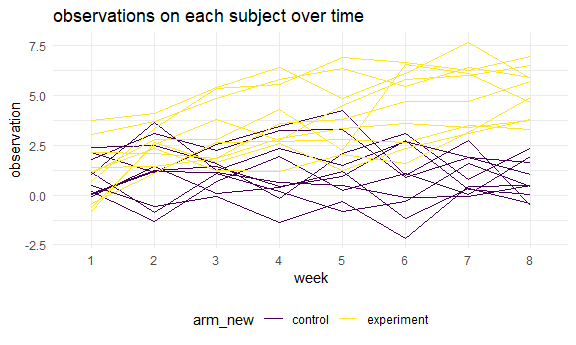

HW 5
================
Elaine Xu
11/14/2020

## Problem 1

Read in the data.

``` r
homicide_df = 
  read_csv("homicide_data/homicide-data.csv") %>% 
  mutate(
    city_state = str_c(city, state, sep = "_"),
    resolved = case_when(
      disposition == "Closed without arrest" ~ "unsolved",
      disposition == "Open/No arrest"        ~ "unsolved",
      disposition == "Closed by arrest"      ~ "solved",
    )
  ) %>% 
  select(city_state, resolved) %>% 
  filter(city_state != "Tulsa_AL")
```

Let’s look at this a bit

``` r
aggregate_df = 
  homicide_df %>% 
  group_by(city_state) %>% 
  summarize(
    hom_total = n(),
    hom_unsolved = sum(resolved == "unsolved")
  )
```

Can I do a prop test for a single city?

``` r
prop.test(
  aggregate_df %>% filter(city_state == "Baltimore_MD") %>% pull(hom_unsolved), 
  aggregate_df %>% filter(city_state == "Baltimore_MD") %>% pull(hom_total)) %>% 
  broom::tidy()
```

    ## # A tibble: 1 x 8
    ##   estimate statistic  p.value parameter conf.low conf.high method    alternative
    ##      <dbl>     <dbl>    <dbl>     <int>    <dbl>     <dbl> <chr>     <chr>      
    ## 1    0.646      239. 6.46e-54         1    0.628     0.663 1-sample~ two.sided

Try to iterate ……..

``` r
results_df = 
  aggregate_df %>% 
  mutate(
    prop_tests = map2(.x = hom_unsolved, .y = hom_total, ~prop.test(x = .x, n = .y)),
    tidy_tests = map(.x = prop_tests, ~broom::tidy(.x))
  ) %>% 
  select(-prop_tests) %>% 
  unnest(tidy_tests) %>% 
  select(city_state, estimate, conf.low, conf.high)
```

``` r
results_df %>% 
  mutate(city_state = fct_reorder(city_state, estimate)) %>% 
  ggplot(aes(x = city_state, y = estimate)) +
  geom_point() + 
  geom_errorbar(aes(ymin = conf.low, ymax = conf.high)) + 
  theme(axis.text.x = element_text(angle = 90, vjust = 0.5, hjust = 1))
```


## Problem 2

Import one dataset

``` r
path_df = 
  tibble(
    path = list.files("./data"),
  ) %>% 
  mutate(
    path = str_c("./data/", path),
    data = map(.x = path,~read_csv(.x)),
    arm = str_remove(path, ".csv"),
    arm = str_remove(arm, "./data/")) %>%
   separate(arm,c("arm","id"),sep = "_")%>%
  mutate(
    arm = ifelse(arm == "con", "control", "experiment")
  ) %>%
  unnest(data) %>%
  pivot_longer(
    week_1:week_8,
    values_to = "observation",
    names_to = "week"
  ) %>%
  mutate(week = str_remove(week, "week_")) %>%
  select(-path)

path_df
```

    ## # A tibble: 160 x 4
    ##    arm     id    week  observation
    ##    <chr>   <chr> <chr>       <dbl>
    ##  1 control 01    1            0.2 
    ##  2 control 01    2           -1.31
    ##  3 control 01    3            0.66
    ##  4 control 01    4            1.96
    ##  5 control 01    5            0.23
    ##  6 control 01    6            1.09
    ##  7 control 01    7            0.05
    ##  8 control 01    8            1.94
    ##  9 control 02    1            1.13
    ## 10 control 02    2           -0.88
    ## # ... with 150 more rows

Spaghetti plot

``` r
spaghetti = path_df %>%
  mutate(arm_new = arm) %>%
  unite("subjects", c(arm, id))
  

ggplot()+geom_line(data = spaghetti, aes(x = week, y = observation, group = subjects, color = arm_new))+
  labs(title="observations on each subject over time")
```



From the graph, we can see that experiment groups have increased through
the eight weeks, and it’s overall observation values are higher than
control groups. Control groups’ trends didn’t have a very significant
increase or decrease through these eight weeks.

## Problem 3

Function for t-test

``` r
set.seed(33)

# n = 30
# sigma = 5

ttest = function(mu) {
  
  sim_data = tibble(
    x = rnorm(n = 30, mean = mu, sd = 5),
  )
  
  sim_data %>% 
    summarize(
      t.test(x, mu = 0, conf.level = 0.95) %>%
    broom::tidy() )
}
```

generate 5000 datasets and repeat

``` r
com_result = function(mu){
  
  rerun(5000, ttest(mu)) %>%
    bind_rows() %>%
    select(p.value, estimate)
}

# for mu = 0
com_result(0)
```

    ## # A tibble: 5,000 x 2
    ##    p.value estimate
    ##      <dbl>    <dbl>
    ##  1  0.584    0.449 
    ##  2  0.701   -0.321 
    ##  3  0.336    1.04  
    ##  4  0.752    0.346 
    ##  5  0.0409   2.10  
    ##  6  0.467   -0.633 
    ##  7  0.553   -0.543 
    ##  8  0.951    0.0711
    ##  9  0.727   -0.297 
    ## 10  0.344    0.843 
    ## # ... with 4,990 more rows

``` r
# for mu = 1,2,3,4,5,6

mu_result = tibble(
  mu = c(0,1,2,3,4,5,6)
) %>%
  mutate(output = map(.x = mu, ~com_result(.x))) %>%
  unnest(output) %>%
  select(mu, p.value)
```

plot showing the proportion of times the null was rejected and true mean

``` r
porp_test = mu_result %>%
  group_by(mu) %>%
  filter(p.value < 0.05) %>%
  summarize(
    reject = n(),
    reject = reject/5000
  )

ggplot(data = porp_test, aes(x = mu, y = reject, color = mu)) + geom_line() + geom_point() +
  scale_x_continuous(limits = c(0,6), breaks = seq(0,6,1)) +
  labs(
    x = "true mean",
    y = "Proportion of times the null was rejected"
  )
```


**From the plot above we can see that when the mu is increasing, the
power also increases. When true mean gets larger, the proportion of the
null (mu = 0) was rejected also gets larger and approaching to 1.**

plot showing the average estimate of mu hat on the y axis and the true
value of mu on the x axis.

``` r
ave_estimate = tibble(
  mu = c(0,1,2,3,4,5,6)
) %>%
  mutate(output = map(.x = mu, ~com_result(.x))) %>%
  unnest(output) %>%
  group_by(mu) %>%
  summarize(
    estimate = mean(estimate)
  )

ggplot(data = ave_estimate, aes(x = mu, y = estimate, color = mu)) + geom_line() + geom_point() +
  scale_x_continuous(limits = c(0,6), breaks = seq(0,6,1)) +
  labs(
    x = "true mean",
    y = "average estimate of mu hat"
  )
```


plot the average estimate of mu hat only in samples for which the null
was rejected on the y axis and the true value of mu on the x axis.

``` r
sam_estimate = tibble(
  mu = c(0,1,2,3,4,5,6)
) %>%
  mutate(output = map(.x = mu, ~com_result(.x))) %>%
  unnest(output) %>%
  select(mu, p.value, estimate) %>%
group_by(mu) %>%
  filter(p.value < 0.05) %>%
  summarize(
    estimate = mean(estimate)
  )

ggplot(data = sam_estimate, aes(x = mu, y = estimate, color = mu)) + geom_line() + geom_point() +
  scale_x_continuous(limits = c(0,6), breaks = seq(0,6,1)) +
  labs(
    x = "true mean",
    y = "average estimate of mu hat",
    title = " average estimate of mu hat only in samples for which the null was rejected"
  )
```


**For mu = 0, 1, 2, we can see that the sample average mu hat for which
the null is rejected is different with the true mean. When mu increases
(mu = 3, 4, 5, 6), the sample average mu hat is getting closer and
closer to the true mean, which is approximately equal to the true mean.
This is because when true mean increases, the probability that the null
hypothesis rejected also increases.**
